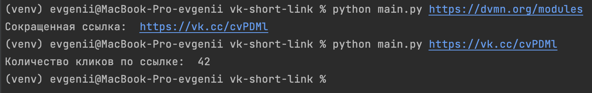

# Скрипт для работы с VK API(methods: ShortLink, getLinkStats)

Этот скрипт предоставляет функциональность для сокращения ссылок и получения статистики кликов по сокращенным ссылкам с помощью API ВКонтакте.

## Особенности

- Проверка, является ли ссылка сокращенной.
- Сокращение длинных ссылок с помощью API VK.
- Получение количества кликов по ссылке.
- Обработка ошибок, связанных с HTTP или сетевыми запросами.
- Использование переменных окружения для безопасного хранения токена доступа.

## Как запустить

1. **Склонируйте репозиторий на свой компьютер:**  
``` git clone git@github.com:Eugene-Bykovsky/devman.git ```  

2. **Перейдите в папку со скриптами:**  
``` cd devman ```

3. **Установите виртуальное окружение и активируйте его:**  
``` python3 -m venv venv ```  
``` source venv/bin/activate ```

4. **Перейдите в папку  со скриптом:**  
``` cd web-api/vk-short-link```  

5. **Установите зависимости:**  
``` pip install -r requirements.txt```

6. **Создайте файл .env**  
Зарегистрируйтесь в VK.   
Получите токен доступа для использования API ВКонтакте.  
Создайте файл .env и переменную окружения VK_API_SERVICE_TOKEN и поместите в нее полученный токен доступа API VK.  
Для получения токена посетите документацию VK API   (https://dev.vk.com/ru/reference)

7. **Запустите скрипт командой и передайте ссылку в терминал в качестве аргумента:**  
``` python main.py <ссылка>```

## Ожидаемый формат вывода 
``` python main.py https://dvmn.org/modules ```  
``` python main.py https://vk.cc/cvPDMl ```  

