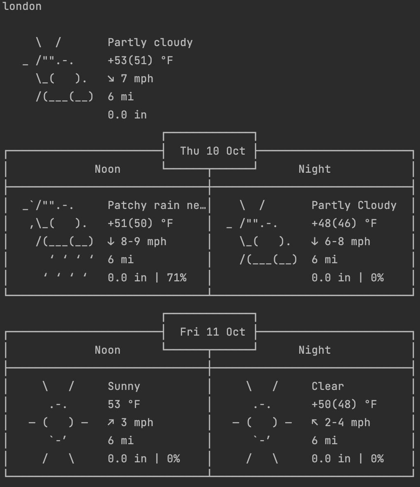

# Скрипт для получения погоды

Скрипт выполняет запрос к API wttr.in для каждого местоположения из списка и отображает данные о погоде в терминале.

## Особенности

- Получение информации о погоде для нескольких местоположений.
- Погодные данные в удобном для терминала формате.
- Обработка ошибок, связанных с HTTP или сетевыми запросами.

## Как запустить

- Для запуска скрипта необходимо скачать папку со скриптами локально на компьютер:  
``` git@github.com:Eugene-Bykovsky/devman.git ```
- Установить виртуальное окружение и активировать его  
``` python -m venv venv ```  
``` source venv/bin/activate ```
- Перейти в папку  со скриптом  
``` cd  web-api\weather```  
- Установить зависимости
``` pip install -r requirements.txt```  
- Запустить скрипт командой
``` python main.py```  

## Ожидаемый формат вывода 
``` python main.py```  


